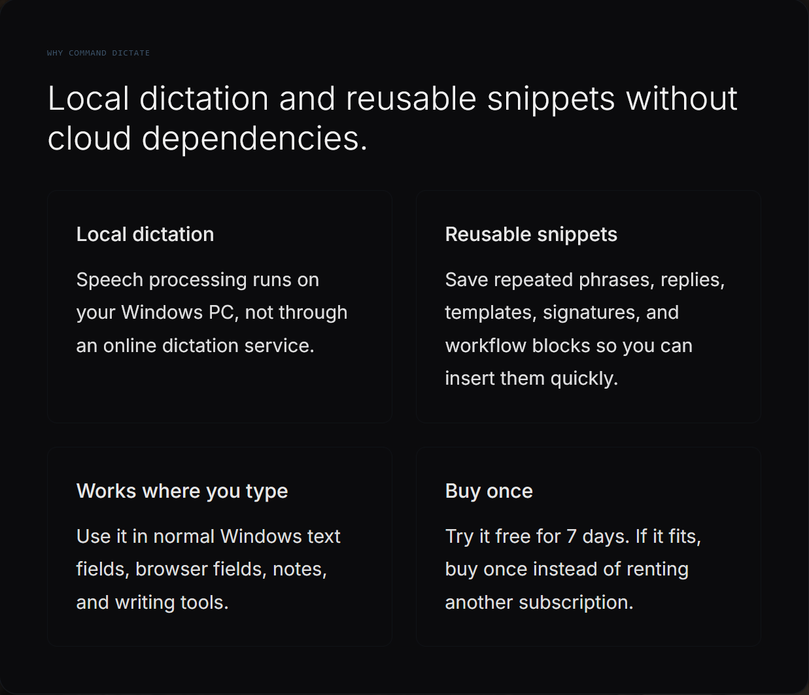
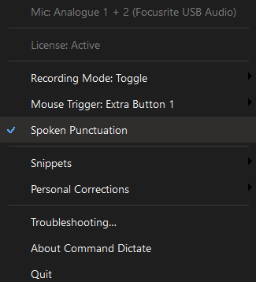
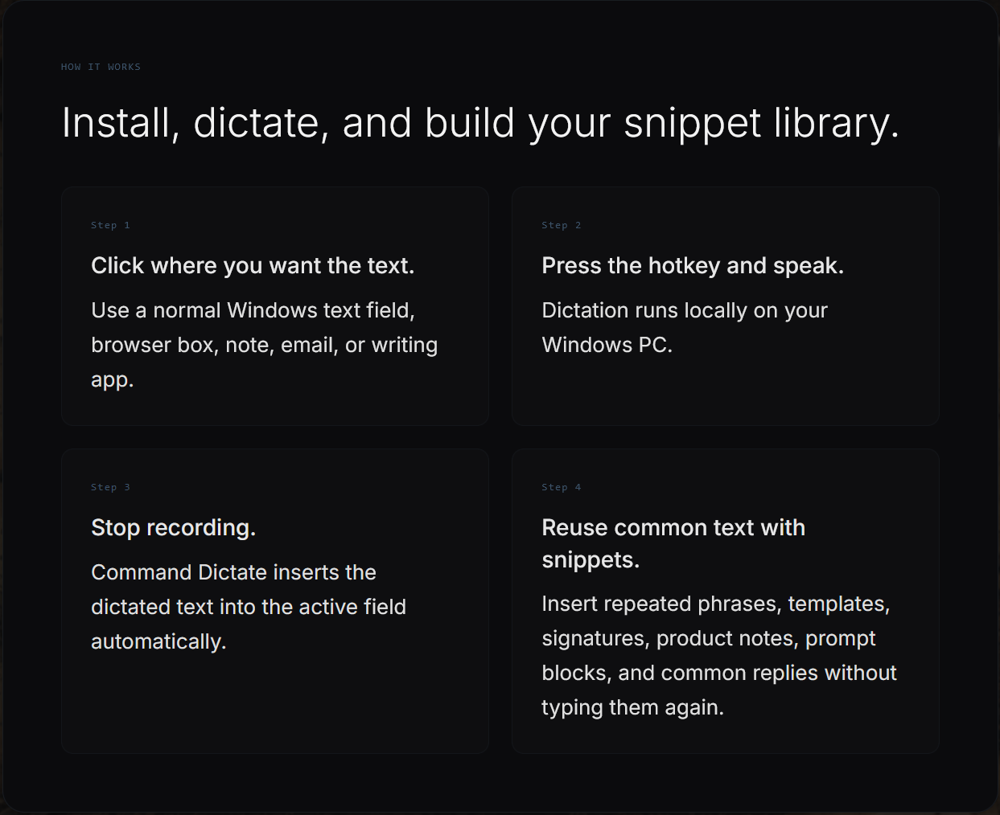

# Command Dictate

Privacy-first offline dictation for Windows 10 and 11.

Press a hotkey anywhere, speak naturally, and inject text into any application using local speech recognition powered by whisper.cpp.

No account.
No cloud required.
7-day trial, no credit card required.

> Current trial downloads are available through GitHub Releases.

---

## Download

Download the latest Windows installer from GitHub Releases:

https://github.com/Nubulizer/Command-Dictate-App/releases/latest

Official website:

https://netagig.com/command

---

## Screenshots

### Local dictation without cloud dependencies

### Lightweight Windows tray workflow

### Install, dictate, and build your snippet library

---

## Why Command Dictate Exists

I got tired of how many voice tools send your voice to somebody else's server just to turn speech into text.

Windows voice typing sends audio to Microsoft.
Many AI tools require cloud APIs.
Every app seems to have its own microphone button.
More and more software feels rented instead of owned.

Command Dictate was built as a local-first alternative for people who want voice input without handing their voice to a remote service every time they talk to their own computer.

---

## What It Does

Command Dictate is a universal offline dictation layer for Windows.

Instead of opening a separate app or hunting for microphone buttons, you press a hotkey or configured mouse button, speak naturally, and Command Dictate inserts the dictated text into the active application.

It is designed for:

* developers
* writers
* homelab users
* local AI users
* support workflows
* eBay/product listing workflows
* note-taking
* email
* prompts
* chat apps
* browser text fields
* normal Windows text entry

---

## Core Features

### Offline dictation

Speech recognition runs locally on your Windows PC using whisper.cpp.

Your voice is not sent to cloud speech APIs or remote servers.

### Global hotkey recording

Use Command Dictate from normal Windows text fields, browsers, notes, writing apps, chat apps, IDEs, and other text-entry workflows.

### Toggle or hold-to-record workflow

Use the recording mode that fits how you work.

### Mouse trigger support

Trigger dictation from a supported mouse button for fast hands-on workflows.

### Spoken punctuation

Convert spoken commands such as "comma", "period", "question mark", and "new line" into punctuation and formatting.

### Reusable snippets

Save repeated phrases, templates, signatures, prompt blocks, support replies, product notes, and workflow text for quick reuse.

### Personal corrections

Create custom corrections for names, product terms, project names, technical terms, and recurring recognition mistakes.

### Tray-based control

Command Dictate runs quietly in the Windows tray with quick access to recording mode, mouse trigger settings, snippets, personal corrections, troubleshooting tools, and license status.

### Local-first licensing

Command Dictate is designed around local ownership instead of subscription-first access.

---

## Privacy

Command Dictate performs speech recognition locally on your machine.

No account is required for the trial.
No cloud speech processing is required.
No credit card is required to try it.

---

## Trial

Command Dictate includes a 7-day free trial.

No credit card required.

After the trial, the app is intended to be purchased once instead of rented as another monthly subscription.

---

## Status

Command Dictate is actively being developed.

Bug reports, feedback, and workflow suggestions are welcome through GitHub Issues.

---

## Notes

This public repository is for downloads, screenshots, release notes, and user feedback.

The application source code is not currently open source.
